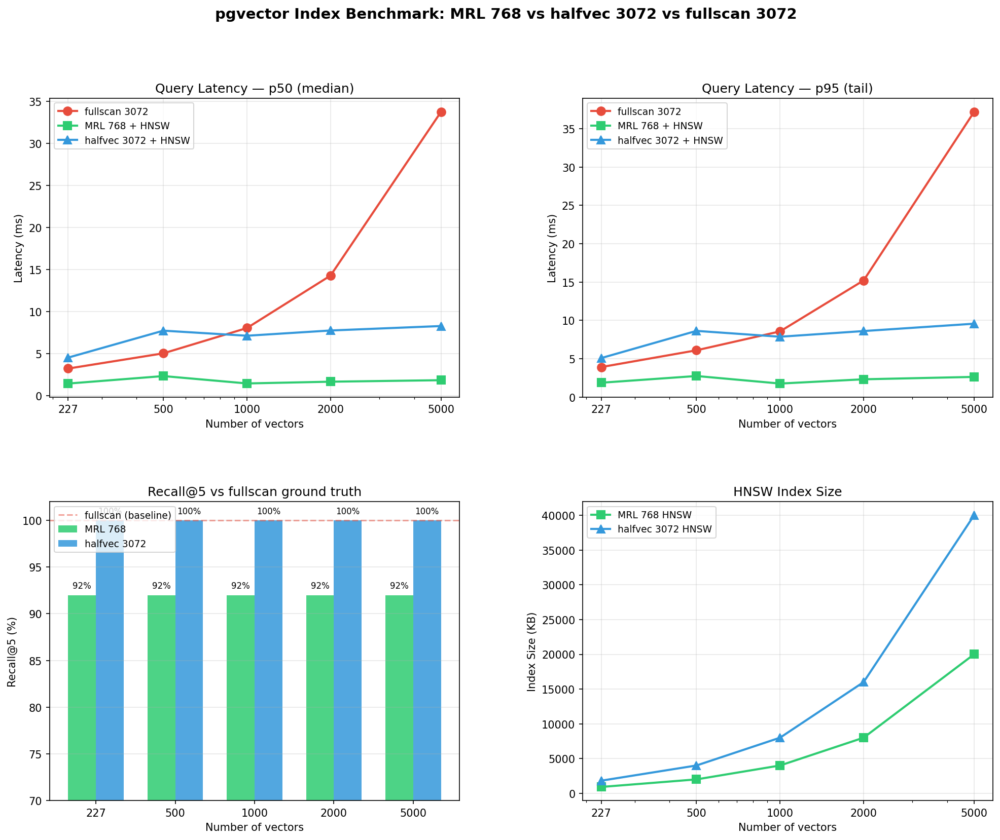

# pgvector 인덱스 벤치마크 리포트

## 1. 배경

### 문제
- 임베딩 모델: `gemini-embedding-001` (기본 출력 3072차원)
- pgvector `float32` 기준 HNSW/IVFFlat 인덱스는 **최대 2,000차원**까지만 지원
- 3072차원 그대로 저장하면 인덱스 생성 불가

### 비교 대상
| 방식 | 설명 | 인덱스 |
|---|---|---|
| **fullscan 3072** | `vector(3072)`, 인덱스 없음 | 없음 (순차 스캔) |
| **MRL 768** | Gemini API에서 `output_dimensionality=768`로 축소 후 `vector(768)` 저장 | HNSW |
| **halfvec 3072** | 기존 3072차원을 `halfvec(3072)` (float16)으로 저장. 4,000차원까지 인덱스 가능 | HNSW |

---

## 2. 테스트 환경

- **로컬 머신**: macOS, Docker (riduck-db)
- **DB**: PostgreSQL 15 + PostGIS + pgvector 0.8.2
- **임베딩 모델**: gemini-embedding-001 (Vertex AI)
- **테스트 데이터**: 실제 태그 227개 + 합성 데이터 (노이즈 추가)로 스케일 확장
- **테스트 쿼리**: 10개 ("한강 자전거길", "업힐 산악", "초보 평지 라이딩" 등)
- **반복**: 쿼리당 30회, p50/p95 측정

### 실제 배포 환경과의 차이

로컬 테스트에서 Gemini API 호출은 **로컬 → Google Cloud (us-central1)** 네트워크를 탐.
실제 배포 구조는 **Cloud Run → Gemini API** (동일 GCP 리전 내)이므로:

| 구간 | 로컬 | Cloud Run 배포 |
|---|---|---|
| 클라이언트 → 서버 | N/A | 인터넷 (유저 위치에 따라 다름) |
| 서버 → Gemini API | 로컬→GCP ~200ms | **GCP 내부 ~50-100ms (예상)** |
| 서버 → DB | Docker 로컬 ~1ms | Cloud SQL 같은 리전 ~2-5ms |

**핵심**: Gemini API 호출이 전체 레이턴시의 90%+를 차지하는 구조는 동일.
GCP 내부 통신이라 API 호출이 ~50-100ms로 줄어들 수 있지만, 그래도 DB 쿼리(1-30ms)보다 지배적.
즉 **DB 인덱스 방식 선택보다 API 호출 오버헤드가 병목**이라는 결론은 배포 환경에서도 동일.

---

## 3. 결과

### 3.1 DB 쿼리 속도 (API 호출 제외, 순수 DB만)

| 벡터 수 | fullscan 3072 (p50) | MRL 768 + HNSW (p50) | halfvec 3072 + HNSW (p50) |
|---|---|---|---|
| 227 | 3.22ms | 1.44ms | 4.53ms |
| 500 | 5.03ms | 2.33ms | 7.73ms |
| 1,000 | 8.04ms | 1.45ms | 7.13ms |
| 2,000 | 14.28ms | 1.66ms | 7.75ms |
| 5,000 | 33.75ms | **1.84ms** | 8.28ms |

- fullscan: 데이터에 비례하여 선형 증가 (O(n))
- MRL 768 HNSW: 데이터 늘어도 **거의 일정** ~1.5-1.8ms (O(log n))
- halfvec 3072 HNSW: ~7-8ms로 수렴. MRL보다 4-5배 느림 (차원이 크니까 거리 계산 무거움)

### 3.2 Gemini 임베딩 API 호출 시간 (로컬 → GCP)

| | avg | p50 | p95 |
|---|---|---|---|
| **3072 (기본)** | 288ms | 233ms | 376ms |
| **768 (MRL)** | 198ms | 205ms | 215ms |

- MRL 768이 약 30ms 빠름 (응답 페이로드가 1/4이라 전송 시간 감소)
- 하지만 둘 다 200ms+ → DB 쿼리 대비 압도적으로 큼

### 3.3 실제 E2E 소요 시간 (API + DB, 5,000개 기준)

| | API 호출 | DB 쿼리 | **합계** | API 비중 |
|---|---|---|---|---|
| fullscan 3072 | 233ms | 33.75ms | **267ms** | 87% |
| MRL 768 + HNSW | 205ms | 1.84ms | **207ms** | 99% |
| halfvec 3072 + HNSW | 233ms | 8.28ms | **241ms** | 97% |

### 3.4 Recall@5 (3072 fullscan 대비 정확도)

| 벡터 수 | MRL 768 | halfvec 3072 |
|---|---|---|
| 227 | 92% | 100% |
| 500 | 92% | 100% |
| 1,000 | 92% | 100% |
| 2,000 | 92% | 100% |
| 5,000 | 92% | 100% |

- MRL 768: 10개 쿼리 중 4개에서 **5위 결과만** 다름 (1-4위 동일)
- halfvec 3072: 전 구간 **100%** — float16 정밀도 손실이 순위에 영향 없음

### 3.5 인덱스 크기

| 벡터 수 | MRL 768 HNSW | halfvec 3072 HNSW | 비율 |
|---|---|---|---|
| 227 | 920 KB | 1,824 KB | 2.0x |
| 1,000 | 4,008 KB | 8,008 KB | 2.0x |
| 5,000 | 20,008 KB | 40,008 KB | 2.0x |

### 3.6 인덱스 빌드 시간

| 벡터 수 | MRL 768 | halfvec 3072 | 비율 |
|---|---|---|---|
| 227 | 0.073s | 0.798s | 10.9x |
| 1,000 | 0.485s | 6.1s | 12.6x |
| 5,000 | 2.3s | 37.9s | 16.5x |

---

## 4. 차트



---

## 5. 비교 요약

| 항목 | fullscan 3072 | MRL 768 + HNSW | halfvec 3072 + HNSW |
|---|---|---|---|
| DB 쿼리 속도 | ❌ 느림 (선형 증가) | ✅ **가장 빠름** (~1.8ms 일정) | ⚠️ 중간 (~8ms) |
| Recall@5 | ✅ 100% (기준) | ⚠️ 92% (5위 1개 차이) | ✅ **100%** |
| 인덱스 크기 | ✅ 없음 | ✅ 작음 | ⚠️ MRL의 2배 |
| 인덱스 빌드 | ✅ 없음 | ✅ 빠름 | ❌ 느림 (16배) |
| API 호출 | 233ms | **205ms** | 233ms |
| E2E 합계 (5K) | 267ms | **207ms** | 241ms |
| 기존 데이터 호환 | ✅ 현재 상태 | ❌ **재임베딩 필요** | ✅ 캐스팅만 |
| 구현 복잡도 | 없음 | API에 dims 파라미터 추가 | DB 컬럼 타입 변경 |

---

## 6. 결론 및 권장사항

### API 호출이 병목이다
어떤 인덱스 방식을 쓰든 **Gemini API 호출(200ms+)이 전체 레이턴시의 87-99%**를 차지함.
DB 쿼리 최적화(1.8ms vs 8ms vs 34ms)는 유저 체감 차이가 거의 없음.

### 권장: halfvec 3072

| 판단 근거 | 설명 |
|---|---|
| **Recall 100%** | MRL은 92% (5위 차이지만, 정확도가 높을수록 안전) |
| **기존 데이터 호환** | 현재 `vector(3072)` → `halfvec(3072)` 캐스팅만 하면 됨. MRL은 227개 태그 전부 재임베딩 필요 |
| **구현 단순** | DB 컬럼 타입만 변경. API 쪽 코드 수정 없음 |
| **속도 충분** | 5,000개에서 8ms. API 200ms+ 앞에서 무의미한 차이 |

### MRL 768이 더 나은 경우
- 벡터 수가 **10,000개 이상**으로 증가할 때 (인덱스 크기/빌드 시간 차이 유의미)
- API 호출을 **캐싱**해서 DB 쿼리 속도가 지배적이 될 때
- 임베딩 **저장 비용**이 중요할 때 (클라우드 DB 과금)

### 적용 마이그레이션

```sql
-- halfvec 적용
ALTER TABLE tags ALTER COLUMN embedding TYPE halfvec(3072)
  USING embedding::halfvec;

-- HNSW 인덱스 생성
CREATE INDEX idx_tags_embedding ON tags
  USING hnsw (embedding halfvec_cosine_ops)
  WITH (m = 16, ef_construction = 64);
```

```sql
-- 쿼리 변경 (기존)
SELECT ... ORDER BY embedding <=> %s::vector
-- 쿼리 변경 (halfvec)
SELECT ... ORDER BY embedding <=> %s::halfvec
```

---

## 7. 테스트 방법론

### 데이터
- 실제 태그 227개의 3072차원 임베딩 (DB에서 로드)
- MRL 768: 같은 227개 태그를 `output_dimensionality=768`로 Gemini API 재호출
- 스케일 확장: 기존 임베딩에 랜덤 노이즈(σ=0.05~0.3) 추가 후 L2 정규화하여 합성

### 측정
- 각 스케일(227/500/1000/2000/5000)마다 테이블 생성 → 인덱스 빌드 → 쿼리 반복
- 쿼리: 10개 검색어 × 30회 반복, 첫 10% warmup 제외 후 p50/p95 산출
- Recall: fullscan 3072 top-5를 ground truth로, MRL/halfvec 결과와 비교

### 한계
- 합성 데이터는 실제 태그 분포와 다를 수 있음 (속도 추세는 유효)
- 로컬 Docker DB → 프로덕션 Cloud SQL에서는 네트워크 레이턴시 추가 (~2-5ms)
- API 호출 시간은 네트워크 상태에 따라 변동 (GCP 내부에서는 더 빠를 수 있음)

### 재현
```bash
/opt/miniconda3/bin/python3 scripts/benchmark_vector_index_v2.py
```

출력:
- `scripts/benchmark_vector_v2_results.png` (차트)
- `scripts/benchmark_vector_v2_results.json` (상세 데이터)
